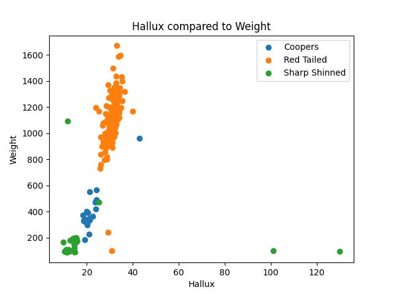
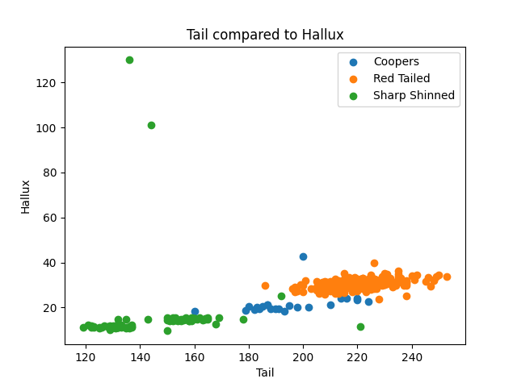
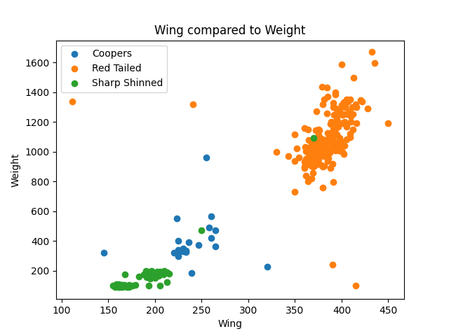

# Human vs Machine Learning Project

This project challenges you to explore the differences between human-designed algorithms and machine learning models. You will first create a human algorithm (pseudo-code) to classify data based on features, then translate that algorithm into Python. Next, you will train a K-Nearest Neighbors (KNN) classifier on the same dataset and compare your results. Finally, you will record a short screen-share with narration explaining your methods and observations.

You may work alone or with a partner. You may choose to work with the provided Penguins dataset, or select your own pre-cleaned dataset from the links below (I have suggested a few datasets as a guide, but you are welcome to select something different with approval).  The most important detail regarding your data-set is that your data needs to lend itself to classification.  For example, an iris with a sepal length of x and a petal width of y can be classified as ‘Setosa’. I also recommend that you use github codespaces, as you will need access to command-line tools that are unavailable in VS Code for EDU.

[UCI Machine Learning Repository](https://archive.ics.uci.edu/datasets)
 - Iris (classic 3-class classification)
 - Mushroom (binary classification: edible/poisonous)
 - Student Performance (predict grades, numeric features)

[Kaggle Datasets](https://www.kaggle.com/datasets)   *Note: For Kaggle, I will have to download the data for you and post on a shared drive.
 - Titanic survival dataset (binary classification)
 - Heart disease dataset (binary classification)
 - Breast cancer diagnosis (binary)
 - Penguins dataset (same as Kira, already cleaned)

---

**Team Members:**  
- Noah Kent

**Dataset Used:**  
Hawks

**Source:**  
Kaggle

**Target Variable (What I am predicting):**  
Species

**Features Used:**  
- Hallux
- Weight

**[Video Review](https://)**

## Human Algorithm






### Pseudo-Code
```text
if hallux < 17 or hallux > 50
    predict sharpshinned
else if hallux > 26
    predict redtailed
else
    predict coopers
```

When examining the data and visualizations, I focused on hallux because it divided the data the best.

The plots/tables suggested a possible threshold for hallux at 17, and I considered values above or below this point to see how they might relate to species.

From the summary tables and visualizations, it appeared that hallux could influence classification, so I used it for my classification.

### Confusion Matrix

Accuracy: 97.78%

| Actual \ Predicted | CH | RT | SS |
|----|---|---|---|
| CH | 9 | 1 | 0 |
| RT | 1 | 85 | 0 |
| SS | 1 | 0 | 38 |

My algorithm worked very well.

The algorithm did not perform as expected when the input was near the line between two regions.

These examples of success and failure highlight patterns in the data or limitations in my rules, such as how the hallux was a very good indicator of species.


## Machine Learning Model

I chose a value of k = 1 after comparing model performance across different values of k and observing that the results were the same for every k value except 2.

When analyzing the outputs and metrics, I noticed that changing k affected whether a specific hawk was marked correctly, which influenced my final choice.

Based on the results shown in the tables or visualizations, k = 1 best matched my goals for model performance because it had the highest accuracy.

### Confusion Matrix

Accuracy: 97.04%

| Actual \ Predicted | CH | RT | SS |
|----|---|---|---|           
| CH | 7 | 1 | 2 |
| RT | 0 | 85 | 1 |
| SS | 0 | 0 | 39 |

The table/visualization shows a clear pattern where the model predicts ___ when ___, indicating a strong relationship between these features.

The confusion matrix reveals that the model most often confuses coopers hawks, suggesting this class may not follow patterns as strongly.

Compared to the human algorithm, the KNN model is actually less accurate, but only slightly.


